# PHP - MySQL Database Connection

# Table of content

- [Introduction](#introduction)
  - [Overview](#overview)
  - [Approach](#procedural-approach)
- [Tools and Software](#tools-and-software)
- [Setup and SQL](#setup-and-sql)
- [Creating Connections](#creating-connections)
  - [Using Connections](#using-connections)
- [Quick Disclaimer](#quick-disclaimer)
- [Screenshots](#screenshots)
- [Object Oriented Programming in PHP](#object-oriented-programming)
  - [Introduction](#introduction)
  - [Setup](#setup)
  - [Approach](#approach)
  - [File Structure](#file-structure)
  - [Usage](#usage)

## Introduction

Hi, I am Lesly Chuo.
Thanks for checking out this Demo Repository on PHP - MySQL.
I am going to walk you through the basics of establishing a very simple connection to your local Database Server with PHP and Interacting with it using SQL commands. Starting from the terminal (CLI) and integrating it in your HTML project.

### Overview

I am going to demonstrate this using two approach.
**Simple Procedural PHP** and **Object Oriented PHP** follow this link to read more: [How can I sanitize user input with PHP?](https://www.geeksforgeeks.org/differences-between-procedural-and-object-oriented-programming/)

### Procedural Approach

Follow this link to repository: [procedural approach][link here]

### Object Oriented Approach

Follow this link to repository: [procedural approach][link here]

## Tools and Software

1. **Server**: XAMPP
2. **Languages**: PHP/HTML/SQL
3. **Text editor**: VS Code, Sublime text, Atom, Notepad++
4. **Terminal**: Command Prompt, GIT Bash

## Setup and SQL

1. locate xampp directory and start xampp server.
2. access the bin folder: xampp/mysql/bin
3. From here you can access the global **mysql**
4. create a database or access and existing one

Using default user: _mysql -u root_;
After this, you can write basic **SQL commands** perform actions in you **Database**
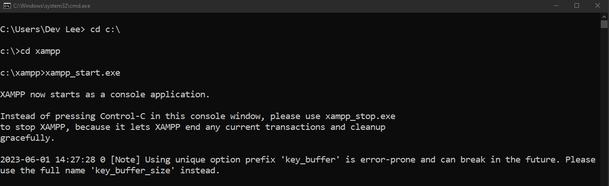
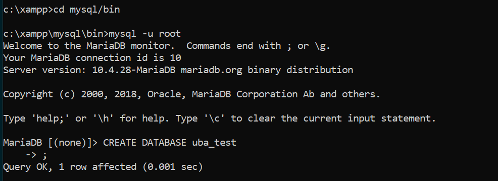

Lets create a databases

```SQL
CREATE DATABASE tb_name;
```

Lets create a database table

```SQL
CREATE TABLE table_name (
  id INT(11) PRIMARY KEY AUTO_INCREMENT NOT NULL,
  first_name VARCHAR(50) NOT NULL,
  ....
  created_at DATETIME  NOT NULL DEFAULT CURRENT_TIMESTAMP(),
)
```

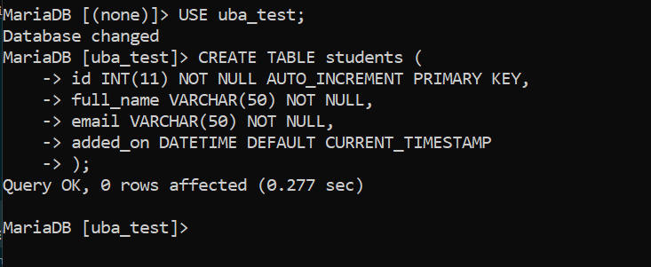

Add Data into Table

```SQL
INSERT INTO table_name (first_name, email)
VALUES ('test', 'test@gmail.com');
```

Add Multiple rows
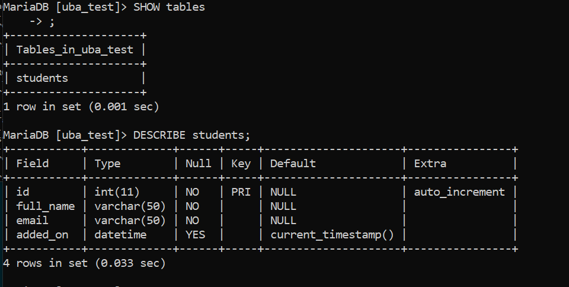

```SQL
INSERT INTO table_name (first_name, email) VALUES
('test', 'test@gmail.com'),
('test2', 'test3@gmail.com'),
('test3', 'test3@gmail.com');
```


Fetch Data form the Table

```SQL
SELECT * FROM table_name;
```

Fetch Specific Data

```SQL
SELECT * FROM table_name WHERE id = '1';
```

OR

```SQL
SELECT * FROM table_name WHERE first_name LIKE 'John';
```

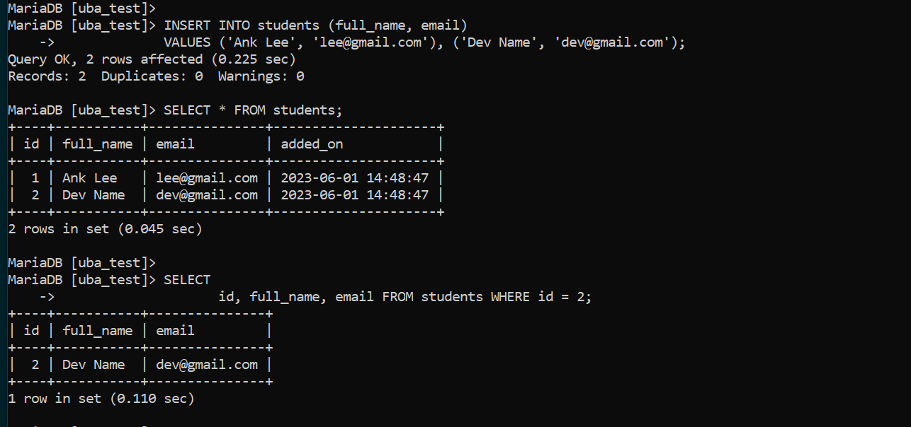

## Creating Connections

PHP has several methods capable of performing database connections like **mysqli_connect()**, **new mysqli()**, and **PDO**.

We will be using **new mysqli()**. Just user preference.

```PHP
$DB_server   =  "localhost";        # Hostname
$DB_user     =  "root";             # Username
$DB_password =  "";                 # Database password
$DB_name     =  "database_name";    # Database name

// Creating Connection
$conn = new mysqli(
                  $DB_server,
                  $DB_user,
                  $DB_password,
                  $DB_name);

if(!$conn) {
  die(mysqli_connect_error()."Connection Failed");
}
else {
  echo "Database Connected Successfully. 😍";
}
```

### Using connection

Integrating connections in a PHP file. save the script above to Database.php

using PHP _include_ or _require_ methods, add this file into your workspace. There you can perform different types of database manipulations with PHP and SQL. This repo contains Demo Source files executing this approach.

```PHP
include_once "database/Database.php";
```

Let's Perform a query.
Create and index.php file and write the code below.

```PHP
include_once "database/Database.php";

$students_sql = "SELECT * FROM students";
$response = mysqli_query($conn, $students_sql);

$student_data = [];

if(mysqli_num_rows($response) > 0) {
  // Using a while to students objects as Associative Arrays
  // storing the inside the $student_data array
  while ($row = mysqli_fetch_assoc($response)) {
    $student_data[] = $row;
  }
}

// Printing out Results from the Database.
echo '<pre>';
print_r($student_data);
echo '</pre>';
```

## Quick Disclaimer

This article is just for demonstration aimed at introducing pure procedural programming with PHP and MySQL Database Administration on the Command Line (CLI),

Data Inserted to any database should always be validated to ensure security and optimization. PHP had many Data Validating methods like **htmlspecialchars()**, **trim()**, **strip_tags()**, **addslashes()** and more

Read this article to understand more about PHP and Data validation methods [How can I sanitize user input with PHP?](https://www.w3docs.com/snippets/php/how-can-i-sanitize-user-input-with-php.html)

## Screenshots.

### Display Data from the Database

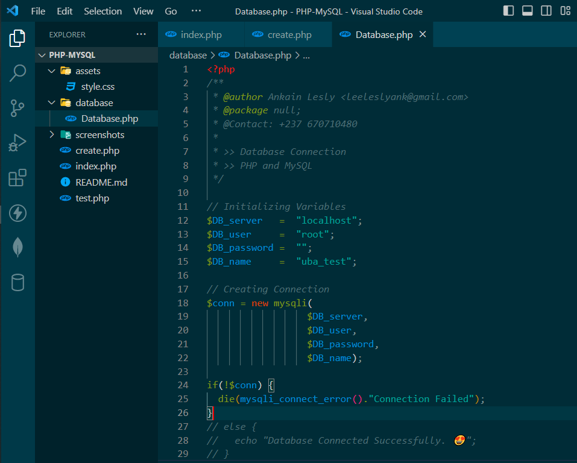
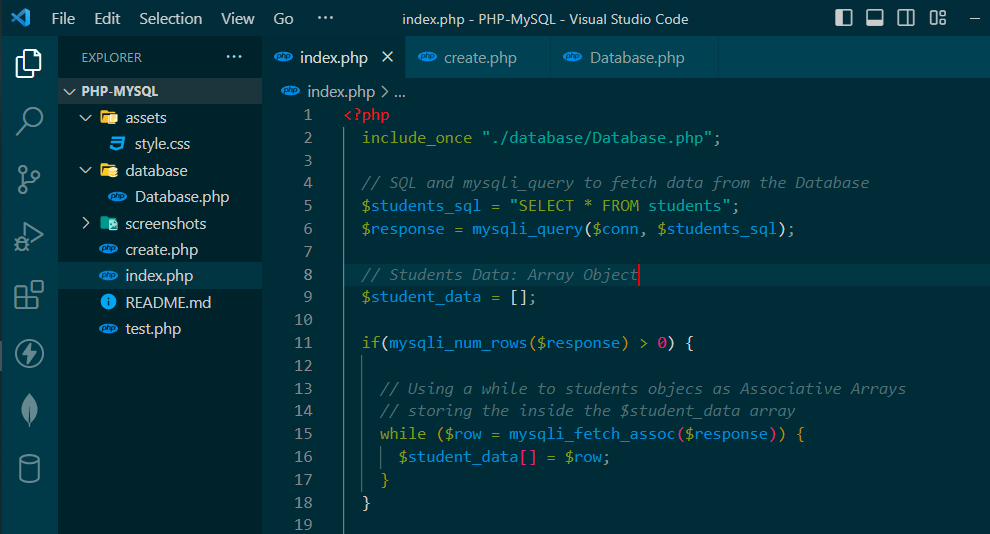
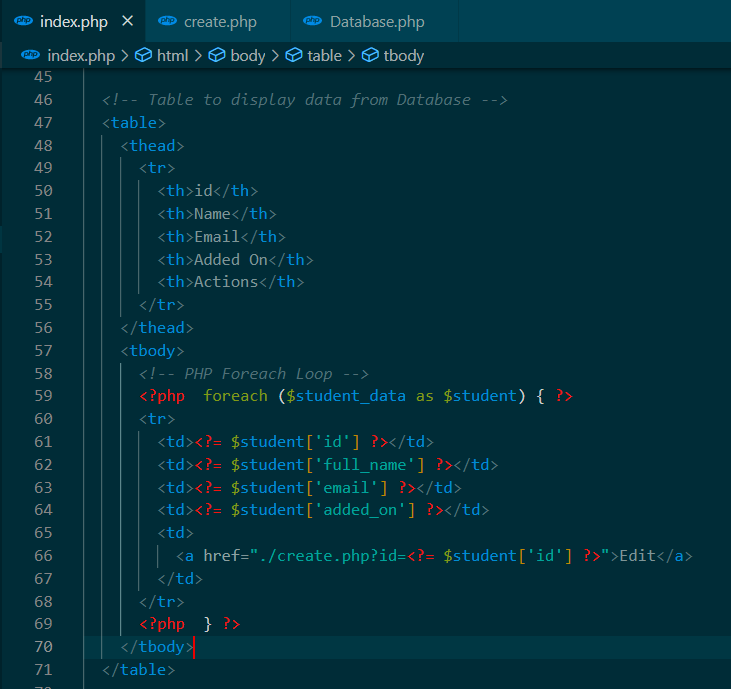
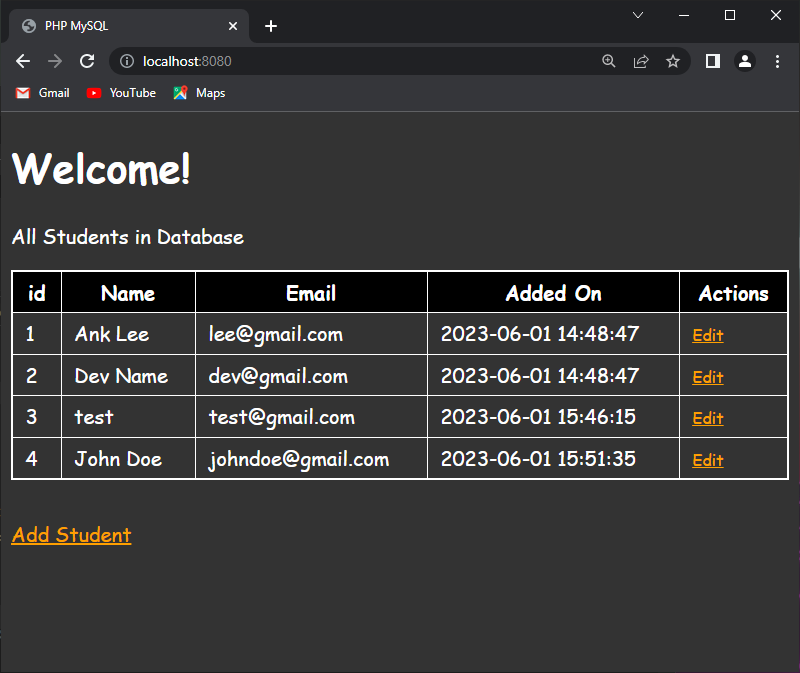

### Add Data to the Database

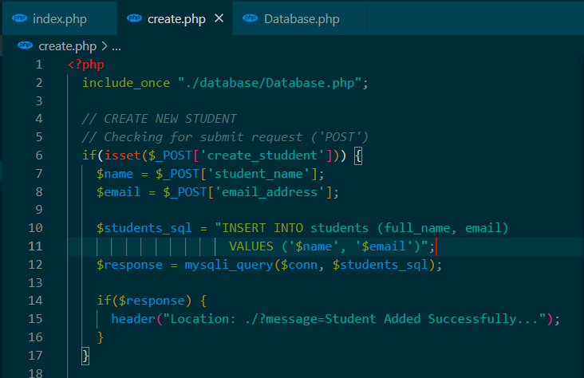
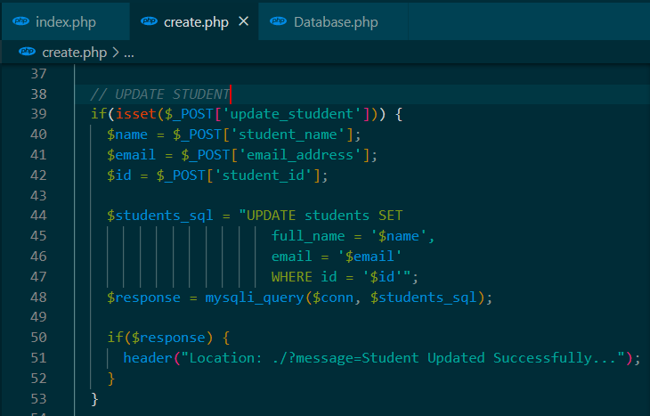
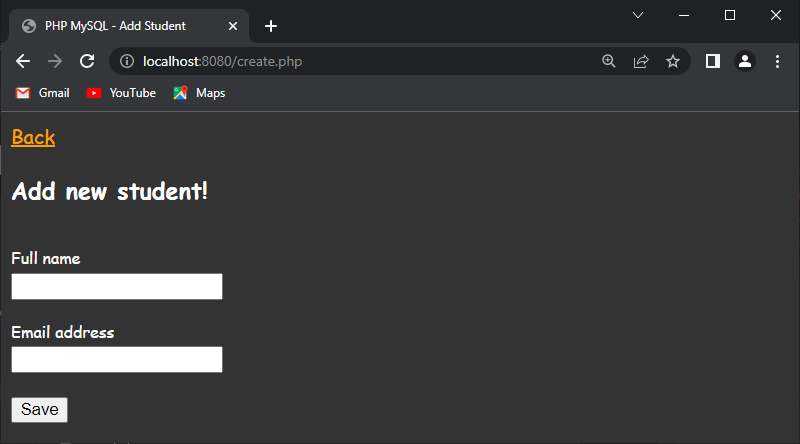
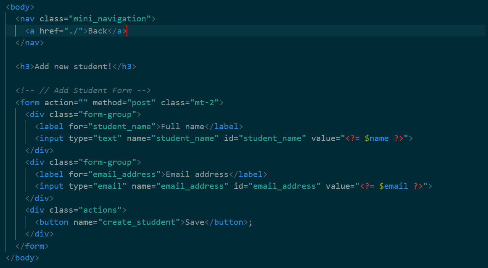

### Results on Submit

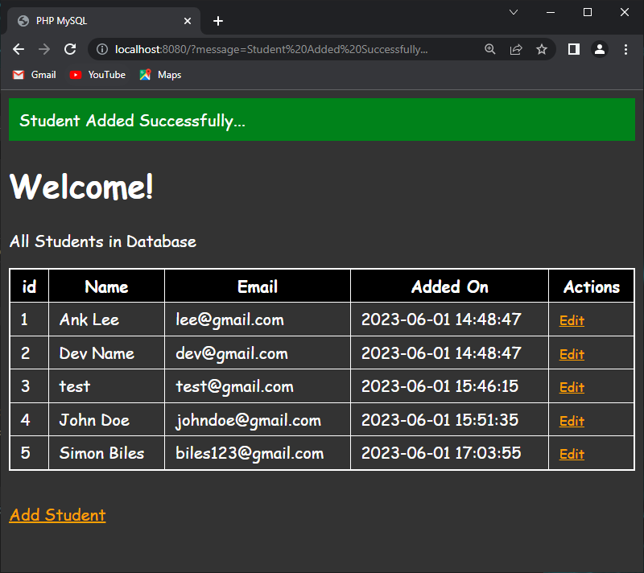

# Object Oriented Programming

## Introduction

OOP stands for Object-Oriented Programming.

Procedural programming is about writing procedures or functions that perform operations on the data, while object-oriented programming is about creating objects that contain both data and functions.

Object-oriented programming has several advantages over procedural programming:

1.  OOP is faster and easier to execute
2.  OOP provides a clear structure for the programs
3.  OOP helps to keep the C++ code DRY "Don't Repeat Yourself", and makes the code easier to maintain, modify and debug
4.  OOP makes it possible to create full reusable applications with less code and shorter development time

Tip: The "Don't Repeat Yourself" (DRY) principle is about reducing the repetition of code. You should extract out the codes that are common for the application, and place them at a single place and reuse them instead of repeating it.

## Setup

Lets Create a Demo Database called **'uba_test'** and a table **'students'**
Run the SQL Cammands below

// Createa a Database

```sql
CREATE DATABASE `uba_test`;
```

// Create students table

```sql
CREATE TABLE `students` (
  `id` int(11) NOT NULL  AUTO_INCREMENT PRIMARY KEY,
  `full_name` varchar(50) NOT NULL,
  `email` varchar(50) NOT NULL,
  `added_on` datetime DEFAULT current_timestamp()
);
```

// Insert some data

```SQL
INSERT INTO `students` (`full_name`, `email`) VALUES
('Wong Lee', 'wonglee@gmail.com'),
('test ', 'test@gmail.com'),
('John Doe', 'johndoe@gmail.com');

```

## Approach

With our new concepts of OOP, our file structure will now differ from the procedural approach.
Separating our logic from our code into controller methods and reusing Database Class when needed. Normally each controller class contain application logic and mapped to a **Model** class that connect to the database.

We shall use just a Controller class for Logic and Database interactions for demonstration.

## File Structure

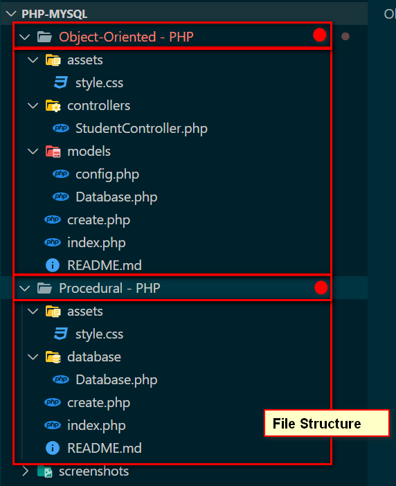

create a congig.php file

```php
<?php
// Custom Variable Constants

# Database Strings,
define("DB_SERVER", "localhost");
define("DB_USER", "root");
define("DB_PASSWORD", "");
define("DB_NAME", "ub_test");


```

Using this constant, in our Database Class.

```php
<?php
namespace app\models;
include_once __DIR__."/config.php";

class Database {

	// Initializing Variables
	private String $DB_server   =  DB_SERVER;
	private String $DB_user     =  DB_USER;
	private String $DB_password =  DB_PASSWORD;
	private String $DB_name     =  DB_NAME;

	private $conn;

	public function __construct()	{

		$connection = new \mysqli(
                  $this->DB_server,
                  $this->DB_user,
                  $this->DB_password,
                  $this->DB_name);

		if(!$connection) {
			die(mysqli_connect_error()."Connection Failed");
		}

		$this->conn = $connection;
	}

	public function connect() {
		return $this->conn;
	}
}


```

Now we have a Database Class and a connect method. Our **\_\_construct()** method will create a database connection on every instance. The **connect()** method return the connection store in a private $conn variable. This will be accessed in our controller class for database manipulation.

PDO is mostly recommenced for large scale application. It provides a variety of methods that enhances secure connections to the Database system.

We shall talk about namespace and usage later on.

Let's use this Database class in our controller class:

```php

<?php
namespace app\controllers;

include_once __DIR__."/../models/Database.php";

// using a namespace definition
use app\models\Database;

// Class Definition
class StudentController {

	// Connection Variables
	private $conn;

  // Using Database Connections
  public function __construct()
  {
    $DB = new Database();
    $this->conn = $DB->connect();
  }

  // methods to Handle logic goes here
  public function functionName($arguments) {
    # code --
  }
}
```

The **\_\_contruct()** will create a new Database instance and store inside the _private $conn_ variable

Lets create a method to add a new student in the Database

```php

  // Add a student into Database Handler  Method
	public function createStudent() {
    $name = $_POST['student_name'];
    $email = $_POST['email_address'];

    # TODO: sanitize Students Data
    # TODO: create a Student Model to manage Database
    $students_sql = "INSERT INTO students (full_name, email)
                      VALUES ('$name', '$email')";
    $response = mysqli_query($this->conn, $students_sql);

    return $response;
	}

```

Here, To use the connection, we use the keyword **$this->** followed by the variable name **$conn**

Lets create a method to get all students from the Database

```php

  // Get all Students
	public function getStudents() {
    # TODO: create a Student Model to manage Database
    // SQL and mysqli_query,  fetch data from the Database
    $students_sql = "SELECT * FROM students";
    $response = mysqli_query($this->conn, $students_sql);

    # Students Data: Array Object
    $student_data = [];

    if(mysqli_num_rows($response) > 0) {

      while ($row = mysqli_fetch_assoc($response)) {
        $student_data[] = $row;
      }
    }
    return $student_data;
	}
```

## Usage

We have done a lot so far. Lets see how to implement this.

1. Include the Controller Class into your index page
2. Access the class object by namespace and create a new instance of the class.
3. From the new instance, you can access handler methods based on requirements.

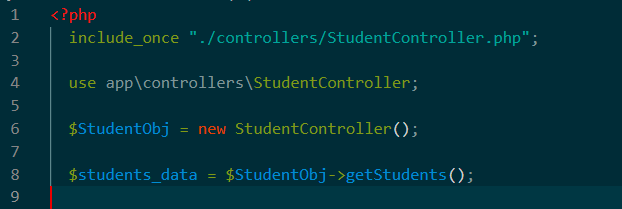
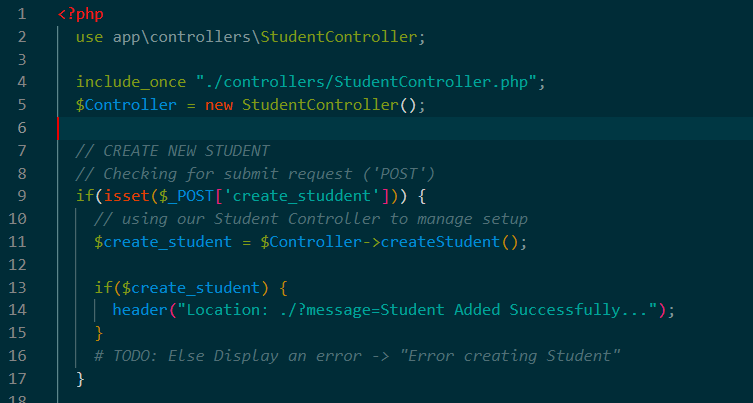
